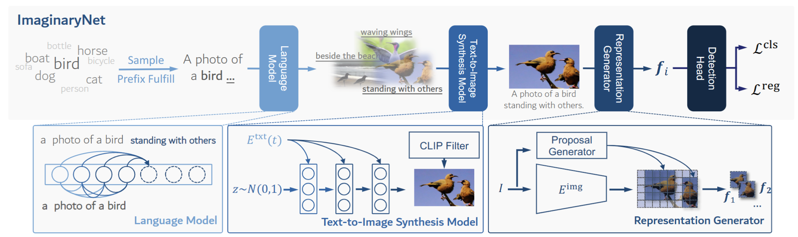

# ImaginaryNet: Learning Object Detectors without Real Images and Annotations

[](https://opensource.org/licenses/MIT)

This repository is for the ICLR 2023 paper: [ImaginaryNet: Learning Object Detectors without Real Images and Annotations](https://arxiv.org/pdf/2210.06886)

If you use any source codes or ideas included in this repository for your work, please cite the following paper.
<pre>
@article{ni2022imaginarynet,
  title={ImaginaryNet: Learning Object Detectors without Real Images and Annotations},
  author={Ni, Minheng and Huang, Zitong and Feng, Kailai and Zuo, Wangmeng},
  journal={arXiv preprint arXiv:2210.06886},
  year={2022}
}
</pre>

If you have any questions, feel free to email [me](Mailto:mhni@stu.hit.edu.cn).

## Abstract

Without the demand of training in reality, humans are able of detecting a new category of object simply based on the language description on its visual characteristics.
Empowering deep learning with this ability undoubtedly enables the neural network to handle complex vision tasks, e.g., object detection, without collecting and annotating real images.
To this end, this paper introduces a novel challenging learning paradigm Imaginary-Supervised Object Detection (ISOD), where neither real images nor manual annotations are allowed for training object detectors.
To resolve this challenge, we propose ImaginaryNet, a framework to synthesize images by combining pretrained language model and text-to-image synthesis model.
Given a class label, the language model is used to generate a full description of a scene with a target object, and the text-to-image model is deployed to generate a photo-realistic image. 
With the synthesized images and class labels, weakly supervised object detection can then be leveraged to accomplish ISOD.
By gradually introducing real images and manual annotations, ImaginaryNet can collaborate with other supervision settings to further boost detection performance. 
Experiments show that ImaginaryNet can (i) obtain about 75\% performance in ISOD compared with the weakly supervised counterpart of the same backbone trained on real data, (ii) significantly improve the baseline while achieving state-of-the-art or comparable performance by incorporating ImaginaryNet with other supervision settings.

## Illustration of Framework



## Preparation

You can run the following commands to start up the environment.

```
conda env create -f environment.yaml

conda activate imaginarynet

pip install --upgrade jax==0.3.25 jaxlib==0.3.25+cuda11.cudnn82 -f https://storage.googleapis.com/jax-releases/jax_cuda_releases.html

conda install -c conda-forge cudatoolkit-dev
```

## Pipeline Usage

This pipeline provide the core function of ImaginaryNet: to generate images based on class label.

### Quick Start

```
python imaginarynet.py --num 10000 --classfile voc.txt --gpt --clip --backend dalle-mini
```

### Parameters Explanation

> + --seed Random seed.
> + --num Number of generated images.
> + --classfile Initial classes.
> + --outputdir Output dir.
> + --gpt Use GPT to extend prompt or not.
> + --clip Use CLIP to filter image or not.
> + --backend Use dalle-mini or stablediffusion.
> + --cpu Use CLIP as filter on CPU or not.
> + --threshold The min score CLIP can accept. 

## Reproducibility

To help improve the reproducibility of the community, we provide generated datasets, trained checkpoints, and training logs. Please note that generated images may not be re-generated exactly the same because of the update of the backend and the change of the environment. We did not modify the code of detection backbones. To start training of these backbones, please refer to their original repos. If you want to access the original data or experiments, please download our archives.

### Generated Images

|Name                 |Download Link|
|---------------------|-------------|
|10,000 Imaginary Data|[Download](https://drive.google.com/file/d/1Xx9UqdOHdj5apDCI7hthNcSrRbjb07Gp/view?usp=share_link)|

### Save Checkpoints and Logs

#### Imaginary-Supervised Object Detection (ISOD)

|Backbone|Imaginary Data|mAP  |Checkpoint|Log|
|--------|--------------|-----|----------|---|
|[OICR](https://github.com/ppengtang/oicr)|5K Imaginary  |35.43|[Download](https://drive.google.com/file/d/1Dpdr3Y8SOXmiT-DBZS9u8Iu5Nu5CDxaX/view?usp=share_link)|[Download](https://drive.google.com/file/d/1Arm0XSwHChPrKt2HJG80_bLO_8elg4iG/view?usp=share_link)|

#### Weakly-Supervised Object Detection (WSOD)

|Backbone|Imaginary Data|mAP  |Checkpoint|Log|
|--------|--------------|-----|----------|---|
|[WSDDN](https://github.com/hbilen/WSDDN)|5K Imaginary  |39.90|[Download](https://drive.google.com/file/d/1fb5H7RpcQMxTyyqkGLLrC1H7AbwPa9OI/view?usp=share_link)|[Download](https://drive.google.com/file/d/1wHLS_r44thF9R59XiHIUH1rVMn2X33WZ/view?usp=share_link)|
|[OICR](https://github.com/ppengtang/oicr)|5K Imaginary  |51.39|[Download](https://drive.google.com/file/d/1nHo9AR41_h5u5jIQfub5j0PUtMsuxje1/view?usp=share_link)|[Download](https://drive.google.com/file/d/1GblqDnSp7fN-pAgBZ3oU9cTd7brd3B-h/view?usp=share_link)|
|[W2N](https://github.com/1170300714/w2n_wsod)|5K Imaginary  |65.05|[Download](https://drive.google.com/file/d/1Lr_2s8xTreoewcQ0_CueLYC6NxT6arDs/view?usp=share_link)|[Download](https://drive.google.com/file/d/1YD0FDCsj0CDr4fRLFWHRlOj57PfVbuwv/view?usp=share_link)|

#### Semi-Supervised Object Detection (SSOD)

|Backbone        |Real Data |Imaginary Data|mAP  |Checkpoint|Log|
|----------------|----------|--------------|-----|----------|---|
|[Unbiased-Teacher](https://github.com/facebookresearch/unbiased-teacher)|5K VOC2007|5K Imaginary  |80.36|[Download](https://drive.google.com/file/d/1S7xaDj5SWUaJWop6WPQDlGvd2SD2eEq1/view?usp=share_link)|[Download](https://drive.google.com/file/d/1kegv3HaxSBVltT_lClnIhCnI2B5bMqe3/view?usp=share_link)|
|[Unbiased-Teacher](https://github.com/facebookresearch/unbiased-teacher)|5K VOC2007|10K Imaginary  |80.60|[Download](https://drive.google.com/file/d/1flCITKPqE5E5hiu4PYAXaN8HuVlNkver/view?usp=share_link)|[Download](https://drive.google.com/file/d/16_EXAnYdbHd0jHbcJgDY9e7_3ODwX6Y2/view?usp=share_link)|
|[Unbiased-Teacher](https://github.com/facebookresearch/unbiased-teacher)|5K VOC2007 + 10K VOC2012 (un-labeled)|10K Imaginary  |81.60|[Download](https://drive.google.com/file/d/1IwPaIwifa6RdYqHhNGOZxWgmFLVb2Uz6/view?usp=share_link)|[Download](https://drive.google.com/file/d/1sp1kHOOfqzRBhicM6GaDK7v5ke8Ih1nL/view?usp=share_link)|

## Acknowledgement

We greatly appreciate Yeli Shen for his contribution in the public code of ImaginaryNet.